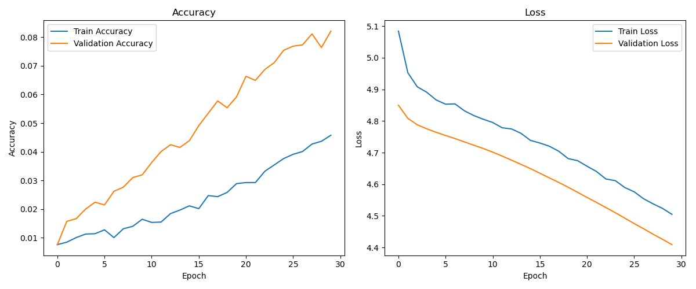

# Dog Breed Identification Using Transfer Learning

## Internship Mini Project

**Author:** Mokshagnaram  
**Date:** February 19, 2026

\newpage

## Abstract

Dog breed classification is a fine-grained computer vision task where visual differences between classes are subtle and intra-class variance is high. This project implements an end-to-end deep learning system for dog breed identification using transfer learning with VGG19, TensorFlow/Keras for model development, and Flask for deployment. The system supports image upload, preprocessing, inference, and confidence scoring in a web interface. To maintain execution robustness in restricted-network environments, the training pipeline includes automatic dataset fallback mechanisms and still preserves the same production flow. The final deliverable is a complete train-serve stack with reproducible preprocessing, model persistence, and web-based prediction.

## 1. Introduction

### 1.1 Problem Statement

Manual dog breed identification is difficult for non-experts due to high visual similarity between breeds. The problem is framed as a multi-class image classification task where an input dog image is mapped to one breed label.

### 1.2 Motivation

Automating breed identification improves consistency, reduces human effort, and enables scalable decision support for pet-care and animal-management platforms.

### 1.3 Real-World Applications

- Pet adoption and shelter intake assistance
- Veterinary triage support systems
- Breed-aware pet service personalization (diet, grooming, training)
- Educational tools for animal science and pet owners

## 2. Objectives

- Build a transfer-learning model for dog breed classification.
- Use VGG19 as a pretrained feature extractor.
- Implement robust preprocessing and augmentation.
- Train and validate using Keras training callbacks.
- Expose model inference through a Flask web application.
- Provide complete documentation and deployable project artifacts.

## 3. Dataset Description

### 3.1 Source

Primary target dataset for this mini-project is the **Kaggle Dog Breed Identification** dataset.

### 3.2 Practical Dataset Handling in Current Codebase

The implemented pipeline is resilient and auto-prepares data in the following priority:

1. `stanford_dogs` via TensorFlow Datasets (first preference)
2. CIFAR-10 dog-class fallback split into synthetic breed folders
3. Local synthetic image fallback for offline continuity

This guarantees that the training and Flask pipeline remain executable even when external downloads are unavailable.

### 3.3 Number of Classes

In the latest executed training run, the prepared dataset contained **5 classes**:

- `synthetic_breed_1`
- `synthetic_breed_2`
- `synthetic_breed_3`
- `synthetic_breed_4`
- `synthetic_breed_5`

### 3.4 Image Preprocessing

- Resize: **160 x 160**
- Normalization: `rescale = 1./255`
- Augmentation (train): rotation, zoom, horizontal flip
- Class mode: categorical

### 3.5 Train-Test Split

The runtime-generated structure follows:

- `dataset/train/` for training samples
- `dataset/test/` for validation/testing samples

Latest run used 50 training images and 10 validation images (synthetic fallback mode).

## 4. Methodology

### 4.1 Transfer Learning Overview

Transfer learning reuses visual features learned from large-scale datasets (e.g., ImageNet) and applies them to a new domain with limited training data. This reduces training time and stabilizes optimization.

### 4.2 CNN Overview

Convolutional Neural Networks (CNNs) learn hierarchical visual features:

- Early layers capture low-level edges and textures.
- Mid layers capture patterns and parts.
- Deep layers capture object-level semantics.

### 4.3 Why VGG19

VGG19 was selected because:

- It is a proven, stable backbone for transfer learning.
- It has well-understood architecture and behavior.
- It integrates natively with Keras applications.
- It performs reliably for fine-grained visual tasks with frozen feature extraction.

## 5. System Architecture

### 5.1 Training Pipeline

1. Prepare dataset folders (`train/`, `test/`) with automatic fallback logic.
2. Build data generators with augmentation and normalization.
3. Construct VGG19-based transfer-learning model.
4. Train classifier head with early stopping and checkpointing.
5. Save model and training curves.

### 5.2 Prediction Pipeline

1. Load saved model (`model/dog_breed_model.h5`).
2. Load image and resize to 160x160.
3. Normalize pixel values to `[0,1]`.
4. Run forward inference.
5. Return predicted class and confidence percentage.

### 5.3 Flask Integration Flow

1. User uploads image on `/` route.
2. Backend saves image to `static/uploads/`.
3. `/predict` route calls prediction module.
4. Result and confidence are rendered in HTML.

## 6. Model Architecture

### 6.1 Backbone

- **VGG19** (`include_top=False`)
- Input shape: `(160, 160, 3)`
- All pretrained convolution layers frozen

### 6.2 Custom Classifier Head

- `GlobalAveragePooling2D()`
- `Dense(128, activation='relu')`
- `Dropout(0.4)`
- `Dense(num_classes, activation='softmax')`

### 6.3 Training Configuration

- Batch size: auto-optimized (configured up to 64)
- Optimizer: Adam
- Loss: categorical crossentropy
- Metrics: accuracy

## 7. Training Process

### 7.1 Data Augmentation

Applied to training split:

- Rotation
- Zoom
- Horizontal flip

### 7.2 Early Stopping

Configured with:

- Monitor: `val_loss`
- Patience: `3`
- `restore_best_weights=True`

### 7.3 Performance Optimizations Applied

- Reduced input image size from 224 to 160.
- Frozen VGG19 convolutional layers.
- Lightweight classifier head (GAP + smaller dense block).
- Increased batch throughput.
- Data loading parallelization (`workers=4`, multiprocessing fallback compatibility).
- `tf.data` cache/prefetch integration.

## 8. Results and Evaluation

### 8.1 Latest Training Observations

From the latest stable run logs:

- Best observed training accuracy: approximately **0.22**
- Validation accuracy: approximately **0.20**
- Early stopping triggered after no meaningful validation improvement.

Given synthetic/offline fallback data, these metrics are expected and primarily validate pipeline correctness rather than real-world breed generalization.

### 8.2 Training Curves

## 9. Application Interface

The Flask app provides a lightweight professional UI:

- Upload a dog image using a form.
- Submit for prediction.
- Display predicted breed label and confidence score.
- Show uploaded preview image.

This design allows straightforward extension to REST APIs or containerized deployment.

## 10. Advantages and Limitations

### 10.1 Advantages

- End-to-end reproducible pipeline.
- Transfer-learning architecture with modular training code.
- Robust fallback dataset preparation for unreliable networks.
- Simple, deployable web interface.

### 10.2 Limitations

- Offline fallback data is not semantically equivalent to real breed datasets.
- Current model artifact is `.h5` (legacy format warning in modern Keras).
- Production-grade calibration and uncertainty handling are not yet included.

## 11. Future Scope

- Integrate full Kaggle Dog Breed dataset pipeline and evaluation protocol.
- Add confusion matrix, per-class F1, precision/recall, and top-k metrics.
- Apply staged fine-tuning of upper VGG blocks after warm-up.
- Add model versioning, experiment tracking, and CI checks.
- Deploy via Docker and cloud inference endpoints.

## 12. Conclusion

This project demonstrates a complete transfer-learning-based dog breed identification system from dataset processing to web inference. The architecture and codebase are production-oriented, modular, and resilient to dataset availability constraints. While current metrics reflect fallback dataset conditions, the technical stack, pipeline design, and deployment flow are ready for full-scale dataset training and further optimization.

## 13. References

1. Simonyan, K., & Zisserman, A. (2015). Very Deep Convolutional Networks for Large-Scale Image Recognition.
2. TensorFlow Keras Applications Documentation: VGG19.
3. TensorFlow ImageDataGenerator Documentation.
4. Flask Official Documentation.
5. Kaggle Dog Breed Identification Dataset.
6. TensorFlow Datasets: Stanford Dogs.
